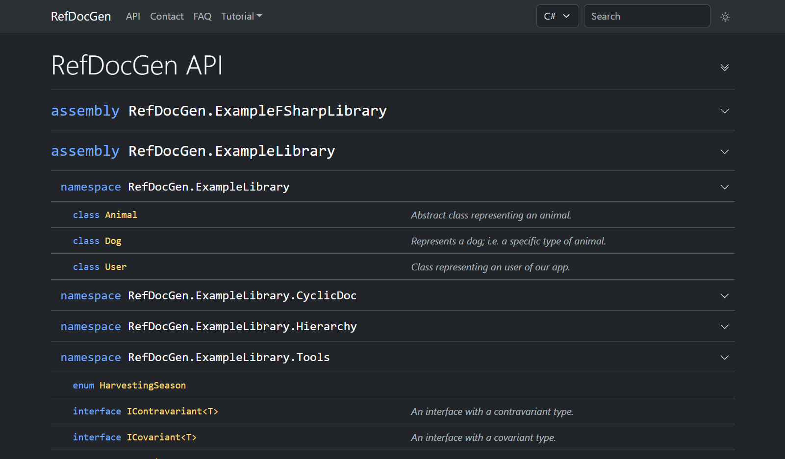
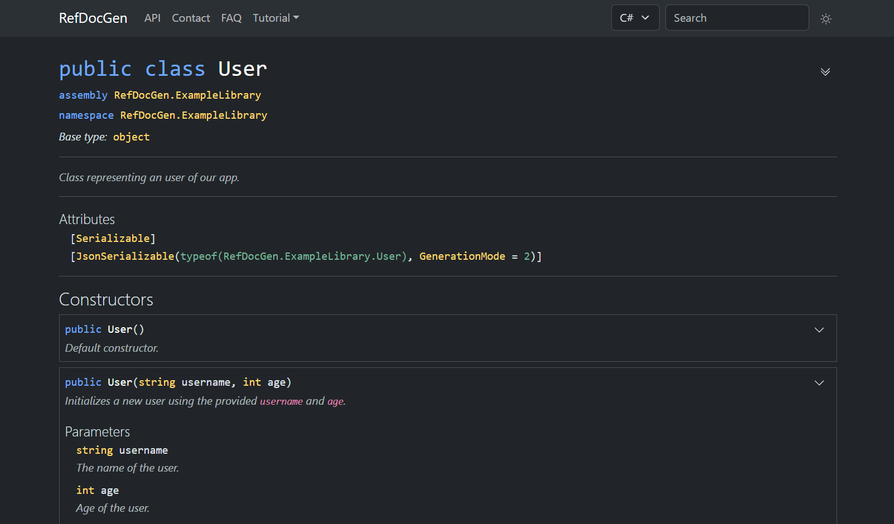

# RefDocGen - Reference Documentation Generator for .NET

[](https://www.nuget.org/packages/RefDocGen)
[](https://www.nuget.org/packages/RefDocGen)
[](https://github.com/VL-CZ/refdocgen/actions/workflows/dotnet.yml)

RefDocGen is a reference documentation generator for .NET.

> 💡 The README covers everything you’ll need for most scenarios. For the complete reference, please visit the [documentation on GitHub Pages](https://vl-cz.github.io/refdocgen/).

## Features

- easy to use (installed as a [.NET tool](https://learn.microsoft.com/en-us/dotnet/core/tools/global-tools))
- supports all standard XML documentation tags
- resolves `inheritdoc` tags
- modern, responsive UI supporting both light and dark mode
- support for documentation versioning
- option to add custom pages (*index*, *FAQ*, ...)
- built-in search functionality

Default UI:





## Demos
- [reference documentation of an example library](https://vl-cz.github.io/refdocgen-demo-example-library/)
- [reference documentation of this project](https://vl-cz.github.io/refdocgen/api/index.html)
- [reference documentation of `Newtonsoft.JSON`](https://vl-cz.github.io/refdocgen-demo-third-party/v-newtonsoft/)
- [reference documentation of `YamlDotNet`](https://vl-cz.github.io/refdocgen-demo-third-party/v-yamldotnet/)
- [reference documentation of `Serilog`](https://vl-cz.github.io/refdocgen-demo-third-party/v-serilog/)

## Installation

Prerequisites:
- .NET 8 (or higher)

Install as a .NET global tool from [NuGet](https://www.nuget.org/packages/RefDocGen):

```
dotnet tool install --global RefDocGen
```

This makes the `refdocgen` command available on the command line.

## Usage
### Prerequisites

Before generating documentation, it is necessary to build the project/solution in *Debug* configuration.
The following MSBuild properties must be set:

- `GenerateDocumentationFile=true` - creates the XML file with documentation
- `CopyLocalLockFileAssemblies=true` - ensures all dependencies are copied to the output folder

Ideally, specify these properties on the command line, as follows:
```
dotnet build -p:GenerateDocumentationFile=true -p:CopyLocalLockFileAssemblies=true
```

It is also possible to set them in the project file or in the *Directory.Build.props*.

**Important: RefDocGen doesn't support .NET Framework projects.**

### Running

Run the following command to generate reference documentation:

```
refdocgen INPUT [OPTIONS]
```

The only mandatory argument is the `INPUT` - an assembly/project/solution to document, or a YAML configuration file (further explained below).

#### Examples

```bash
refdocgen MyLibrary.dll
refdocgen MyLibrary.csproj
refdocgen MyLibrary.sln
```

### Configuration
All available options are listed below (the same output can be displayed by running `refdocgen --help`):

```
INPUT (pos. 0)                                  Required. The assembly, project, or solution to
                                                document, or a YAML configuration file.

-o DIR, --output-dir=DIR                        (Default: reference-docs) The output directory
                                                for the generated documentation.

-t TEMPLATE, --template=TEMPLATE                (Default: Default) The template to use for the
                                                documentation. Valid values: Default

-v, --verbose                                   (Default: false) Enable verbose output.

-f, --force-create                              (Default: false) Forces the creation of the
                                                documentation. If the output directory already
                                                exists, it will be deleted first.

-s, --save-config                               (Default: false) Save the current configuration
                                                to a YAML file.

--static-pages-dir=DIR                          Directory containing additional static pages to
                                                include in the documentation.

--doc-version=VERSION                           Generate a specific version of the documentation.

--min-visibility=VISIBILITY                     (Default: Public) Minimum visibility level of
                                                types and members to include in the
                                                documentation. Valid values: Private,
                                                FamilyAndAssembly, Assembly, Family,
                                                FamilyOrAssembly, Public

--inherit-members=MODE                          (Default: NonObject) Specify which inherited
                                                members to include in the documentation. Valid
                                                values: None, All, NonObject

--exclude-projects=PROJECT [PROJECT...]         Projects to exclude from the documentation.

--exclude-namespaces=NAMESPACE [NAMESPACE...]   Namespaces to exclude from the documentation.

--help                                          Display this help screen.

--version                                       Display version information.
```

### Adding custom static pages

You can include static pages (like *index* or *FAQ*) in the generated documentation, following the steps below:

- create a directory (e.g., `static-pages/`) with `.html` or `.md` files
- each file represents a page and should contain its the body content
- run the generator with:

```
--static-pages-dir static-pages/
```
- thus, the pages are included in the documentation, and links to them appear in the top menu

**Important: The static pages are not designed to offer the functionality of a full-fledged SSG. If you want more control over the pages, is advised to use an SSG, such as Jekyll, for user documentation.**

Additional notes:
- it is possible to use relative links between pages
- you can include images, JS, or any other resources in the static pages directory, and then reference them from the pages
- to add custom CSS styles, put them into `/css/styles.css` and they will be included automatically (however, use custom styles only for minor tweaks, rather than completely changing the overall appearance of the page)
- it is possible to put the pages (and other files) into subdirectories of the `static-pages/` directory (however, pages nested three or more levels deep will not appear in the top menu)

#### Example

Directory structure:
```
static-pages/
    index.html
    FAQ.md
```

`index.html`
```html
<h1>
    MyLibrary reference documentation
</h1>
<div>
    This page contains the reference documentation of MyLibrary.
</div>
```

`FAQ.md`
```markdown
# FAQ

## Q1: How to install the library?
## A1: ...
```

### Documentation versioning

You can optionally generate versioned documentation, allowing users to switch between multiple versions.
To do this, it is necessary to use the `--doc-version` option.

The version can be switched using the dropdown in the bottom menu.

#### Examples

Generate two versions of the documentation, using these commands (the output directory needs to be the same):

```bash
refdocgen MyLibrary.dll --doc-version v1.0

# after version 1.1 is published
refdocgen MyLibrary.dll --doc-version v1.1
```

The documentation versions do not necessarily have to match the library versions.
For instance, we may create two documentation versions, one showing the public API, and the other including even private members, as illustrated below:

```
refdocgen MyLibrary.dll --doc-version v1.0-public
refdocgen MyLibrary.dll --doc-version v1.0-private --min-visibility Private
```

An example of versioned documentation can be found [here](https://vl-cz.github.io/refdocgen-demo-refdocgen/index.html). \
Note that the documentations consists of two versions: `v-public` - displays only the public API and `v-private` displaying all types and members

### YAML configuration
Instead of using command line arguments, it is possible to use a YAML file for configuration. \
Then:
- we don't need to repeat the options every time
- the configuration can be easily shared

The YAML file can be generated automatically using the `--save-config` flag (preferred) or created manually.
It is recommended to name the file `refdocgen.yaml`.

The structure of YAML and command line configuration is very similar:

- all the keys in YAML have the same name as the matching command-line option (without the starting dashes), e.g. the `output-dir` key corresponds to the `--output-dir` option
- the only mandatory key is the `input` (similar to the command-line configuration)
- `save-config` option is not supported, as it does not make sense here
- the default values are the same as in the command-line configuration

#### Examples

The following command results in creating the YAML displayed below:

```bash
refdocgen MyLibrary.sln 
    -o custom-folder
    --verbose 
    --force-create 
    --min-visibility Private 
    --exclude-projects MyLibrary.Tests 
    --exclude-namespaces MyLibrary.Internal MyLibrary.Experimental 
    --save-config # save the configuration into YAML
```

`refdocgen.yaml`

```yaml
input: MyLibrary.sln
output-dir: custom-folder
template: Default
verbose: true
force-create: true
min-visibility: Private
inherit-members: NonObject
exclude-projects:
  - MyLibrary.Tests
exclude-namespaces:
  - MyLibrary.Internal
  - MyLibrary.Experimental
```

The next time we want to use the same configuration, we just need to run `refdocgen refdocgen.yaml` and the configuration will be loaded from the YAML.

### Limitations 

#### Default UI languages
While *RefDocGen* supports programs written in any .NET language, the default UI displays type and member signatures only in C# syntax.
However, the default UI is designed to be extensible, so adding support for other languages, such as F#, is possible in the future.

#### Supported modifiers
*RefDocGen* recognizes most of the C# modifiers and displays them.
However, some modifiers are not supported and therefore do not appear in the generated documentation.  
These are typically implementation details that do not affect the public API.

More specifically, the following modifiers are not supported: `extern`, `file`, `managed`, `new`, `partial`, `record`, `scoped`, `unmanaged`, `unsafe`, `volatile`.

Additionally, these type parameter constraints are not supported:
`notnull`, `unmanaged`, `default`, `allows ref struct`.

#### Non-nullable reference types
Currently, *RefDocGen* doesn't differentiate between nullable non-nullable reference types.
