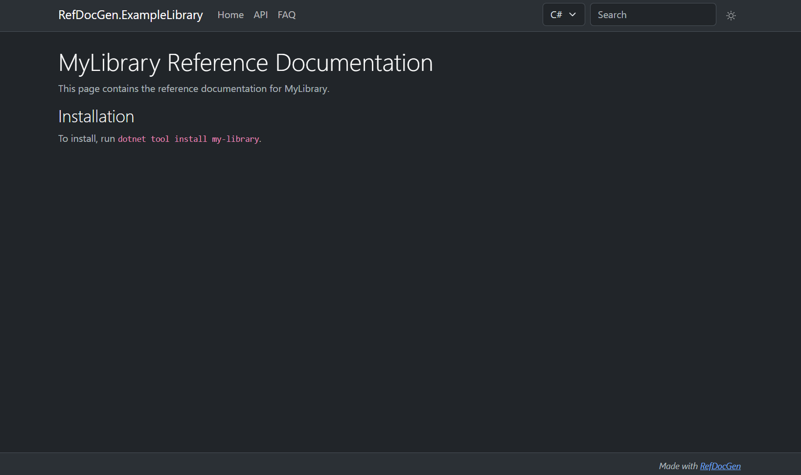
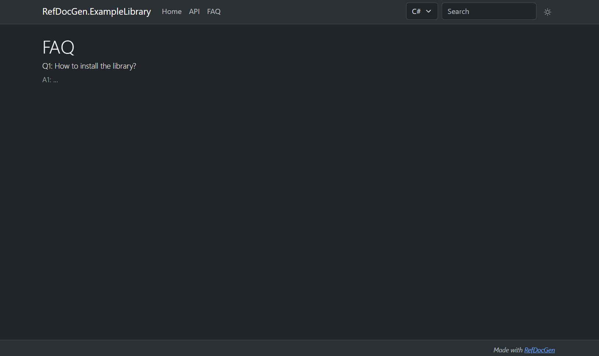

# Adding custom static pages

You can include static pages (like *index* or *FAQ*) in the generated documentation, following the steps below:

- create a directory (e.g., `static-pages/`) with `.md` (preferred) or `.html` files
- each file represents a page and should contain its the body content
- run the generator with:

```
--static-pages-dir static-pages/
```
- thus, the pages are included in the documentation, and links to them appear in the top menu

**Important: The static pages are not designed to offer the functionality of a full-fledged SSG. If you want more control over the pages, is advised to use an SSG, such as Jekyll, for user documentation.**

Additional notes:
- It is possible to use relative links between pages. (Links to `.md` files are automatically updated to point to the correct output HTML files in the generated documentation.)
- you can include images, JS, or any other resources in the static pages directory, and then reference them from the pages
- it is possible to put the pages (and other files) into subdirectories of the `static-pages/` directory (however, pages nested three or more levels deep will not appear in the top menu)
- in case you use HTML pages, to add custom CSS styles, put them into `/css/styles.css` and they will be included automatically (however, use custom styles only for minor tweaks, rather than completely changing the overall appearance of the page)


## Example

Example directory structure:
```
static-pages/
    index.md
    FAQ.html
```

`index.md`
```markdown
# MyLibrary Reference Documentation

This page contains the reference documentation for MyLibrary.

## Installation
To install, run `dotnet tool install my-library`.
```

`FAQ.html`
```html
<h1>FAQ</h1>

<h6>Q1: How to install the library?</h6>
<div class="fw-light">A1: ...</div>
```

### Result



