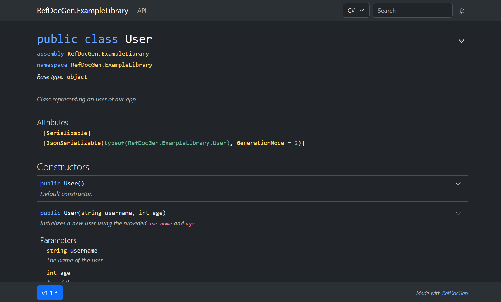

# Documentation versioning

You can optionally generate versioned documentation, which allows users to switch between multiple versions.
To do this, use the `--doc-version` option.

The version can then be switched using the dropdown menu at the bottom of the page, as illustrated below:



## Examples

Generate two versions of the documentation using these commands (the output directory must be the same):

```bash
refdocgen MyLibrary.dll --doc-version v1.0

# after version 1.1 is published
refdocgen MyLibrary.dll --doc-version v1.1
```

The documentation versions do not necessarily have to match the library versions.
For example, you may create two documentation versions: one showing only the public API, and another including private members, as illustrated below:

```
refdocgen MyLibrary.dll --doc-version v1.0-public
refdocgen MyLibrary.dll --doc-version v1.0-private --min-visibility Private
```

## Demo

You can browse an example of versioned documentation [here](https://vl-cz.github.io/refdocgen-demo-example-library/index.html).
